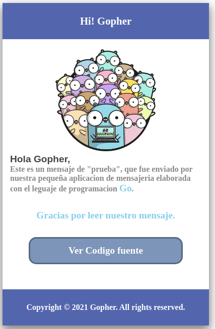

### Application that sends messages by ```GMAIL```.
---
### preview:

#### Run app:
1. **export the following environment variables:**
    - ```export GMAIL='email@example.com'```
    - ```export PASS_GMAIL='secretpass'```
2. **execute command:** 
    - ```go run main.go```
